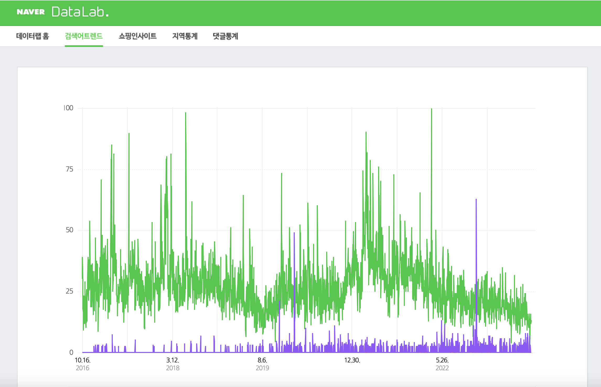

# 논문을 활용한 미술품 경매가 예측

## 파일 목적

이 파일은 서강대학교 텐서플로우 중간고사 **논문분석**을 목적으로 작성되었습니다.

## 사용 논문

- **논문 제목**: 이미지 및 다면적 요소를 활용한 미술품 경매가 예측  
  _Predicting Price in the Art Auction Market using Images and Various Factors_
- **저자**: 김종백
- **제출일**: 2023년 2월
- **학위**: 공학석사 학위논문
- **소속**: 서울과학기술대학교 일반대학원 데이터사이언스학과
 

## 1. 데이터 수집

### 1-1. 미술품 작가 및 작품 데이터

- **출처**: [K art price](http://kartprice.net/)
- **서칭한 작가 목록**: 
  ```python
  search_list = ['이상범', '남관', '이응노', '전광영', '김정희', '서세옥', '이성자', '김기창']

### 1-22. 경제 데이터
KOSPI, WTI, 환율, 부동산 데이터를 수집하였습니다.

### 1-3. 트렌드 데이터
- **출처** : [Naver 데이터랩](https://datalab.naver.com/keyword/trendResult.naver)



## 2. 전처리 과정
### 2-1. 작가 작품 전처리
엑셀 파일 **artprice_total_20241014.xlsx**을 불러와 미술품 데이터의 결측치 처리 및 데이터 클리닝을 진행했습니다.

- **author(작가)**: 저자 정보를 숫자로 매핑하여 처리했습니다.
- **standard(작품의 가로, 세로 정보)**: 넓이를 계산하여 area 변수로 처리했습니다.
- **genre**: 작품의 장르를 각각 숫자로 매핑했습니다.
- **technique**: 재료 정보는 특정 단어를 대체하여 정리하였습니다.
- **source**: 경매 출처를 숫자로 매핑하고, 온라인 여부를 online 변수로 구분했습니다.
- **price**: 가격 데이터를 전처리하여 숫자형으로 변환했습니다.
- **year**: 연도 데이터는 다양한 표기 방식을 통일하여 처리했습니다.

### 2-2. 경제 지표 데이터 병합
KOSPI, WTI, 환율, 부동산 데이터를 각각의 파일로부터 불러와 날짜를 기준으로 병합하였습니다.

### 2-3. 트렌드 데이터 병합
네이버 데이터랩에서 수집한 **'미술품 경매', '미술품 경매업체', '미술품 렌탈'** 관련 데이터를 병합하였습니다.

---

## 3. PCA 적용 및 모델링
### 3-1 각 지표별 PCA 적용
**Art 지표 PCA**


**Economic 지표 PCA**


**Trend 지표 PCA**


## 3. 데이터 모델링

### 3-1. 평가 지표

모델 성능을 평가하기 위해 **RMSE**, **MAE**, **MAPE** 세 가지 지표를 사용합니다. 

### 3-2. 모델 학습 및 평가
Linear Regression, Ridge, Lasso 모델을 학습시키고 평가합니다.
**MLP(Multi-Layer Perceptron) 모델은 GridSearchCV**를 사용하여 최적의 파라미터를 탐색한 후 평가합니다.


### 3-3. PCA 기반 Feature Group 평가
PCA로 변환된 Feature들을 아래와 같이 구성하여 다양한 조합으로 평가합니다.

- Art: 미술품 관련 PCA 요소들 (art_PCA1, art_PCA2, art_PCA3)
- Art + Economic: 미술품 PCA 요소와 경제 관련 PCA 요소들을 결합
- Art + Trend: 미술품 PCA 요소와 트렌드 데이터를 결합
- Art + Economic + Trend: 미술품, 경제, 트렌드 데이터를 모두 결합

### 3-4 최적 모델 선택
RMSE, MAE, MAPE를 기준으로 각 Feature Group과 PCA 컴포넌트별로 가장 성능이 좋은 모델을 선택합니다.

## 4. 결론
### 4-1. 결과 시각화
각 Feature Group과 PCA 컴포넌트별로 MAPE, RMSE, MAE를 그래프로 시각화하여 성능을 비교합니다.

바 차트를 사용하여 각 지표별로 성능을 확인할 수 있습니다.
